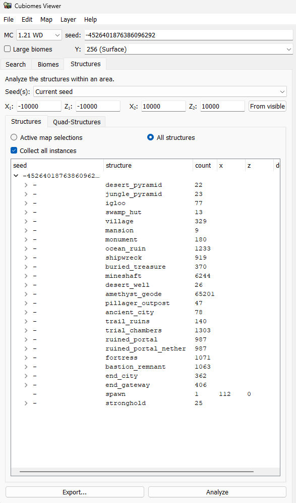

# Minecraft - Structure Clusters
<!-- <div>
    <picture></picture>
    <div>
        <a href="https://ko-fi.com/CathRTic_tv"></a>
    </div>
</div> -->

<br>

<p align="center">
    <a href="#installation-and-usage-guide">Installation and Usage</a>
    <br>
    <a href="#environment-variables">Env. Variables</a> •
    <a href="#structure-data">Structure Data</a>
</p>

<br>

Find clusters of various structures for given Minecraft seeds, using data exported from [Cubiomes Viewer](https://github.com/Cubitect/cubiomes-viewer) by [Cubitect](https://github.com/Cubitect). Use cases include: finding multi-witch huts, dense clusters of multiple structure types, and ideal base building locations for specific Minecraft worlds. 

This project operates independently of Cubiomes Viewer's GPLv3-licensed codebase, encourages its usage, and utilizes its exported structure data as an input.

- Supports structure type whitelisting for specific structure clustering.
- Configurable clustering radius to meet farm, or base requirements.
- Results prioritized by cluster density and proximity to world origin (X: 0, Z: 0).
- Optional plotting capabilities for data visualization and analysis.

<br>

## Installation and Usage Guide
Get started by cloning the repository and installing the required dependencies.

> [!NOTE]
> This project requires [Node.js](https://nodejs.org), and was last tested using `Node.js v22.16.0` and `npm v11.5.0`.\
> Find your versions by running `node -v` and `npm -v` respectively.

<br>

**Install package dependencies:**
```shell
npm install
```

<br>

**Generate clustering results:**
```shell
npm run main
```

<br>

**Input requirements:**

Input structure data should be organized as subfolders within `"./data"` (or your custom `DATA_PATH` if configured). Each subfolder should contain either `data.csv` or `data.txt`.
- For example: `"./data/[Dataset Folder]/data.txt"`

This structure data file should be exported from [Cubiomes Viewer](https://github.com/Cubitect/cubiomes-viewer), following the steps outlined in the [#Structure Data](#structure-data) section below.

<br>

**Generated output files:**

Output files are created in the same location as its corresponding structure input file.
- `results.ansi` / `results.log` - Clustering results with colored/plain text variants.
- `results.png` - Visualization of structure clusters results (requires `DEBUG_PLOT` to be enabled).
- `dbscan.ansi` / `dbscan.log` - DBSCAN results with colored/plain text variants (requires `DEBUG_DBSCAN` to be enabled).
- `dbscan.png` - Visualization of DBSCAN results (requires both `DEBUG_DBSCAN` and `DEBUG_PLOT` to be enabled).


<br>

## Environment Variables
Customize behavior using these environment variables:
| Variable | Default Value | Description |
|----------|---------------|-------------|
| `DATA_PATH` | `"./data"` | Directory path for input structure data and generated output files. |
| `FILTER` | `["swamp_hut"]` | Array of structure types to include in clustering (whitelist). |
| `CLUSTER_RADIUS` | `128` | Maximum radius (in blocks) between structures within the same cluster.<br>NOTE: Total cluster diameter can reach `CLUSTER_RADIUS × 2`.<br>NOTE: Only change this value if clusters larger or smaller than the default mob spawn radius is desired. |
|   |   |   |
| `DEBUG_FORCE` | `false` | Forces results for already processed structure datasets to be recalculated. |
| `DEBUG_DBSCAN` | `false` | Outputs DBSCAN algorithm results. |
| `DEBUG_PLOT` | `false` | Creates visual plots of clustering results as PNG images.<br>WARNING: Image generation may take considerable processing time. |

<br>

> [!NOTE]
> The default configuration targets witch hut clusters within a 256-block diameter (128-block radius), ideal for creating optimal multi-witch hut farm designs.

<br>

**Supported structure types:**
- `spawn` - World Spawn Point
- `stronghold` - Stronghold
<br><br>
- `swamp_hut` - Witch Hut
- `pillager_outpost` - Pillager Outpost
- `monument` - Ocean Monument
- `mansion` - Woodland Mansion
- `ancient_city` - Ancient City
<br><br>
- `jungle_temple` - Jungle Temple
- `desert_pyramid` - Desert Pyramid
- `desert_well` - Desert Well
- `trail_ruins` - Trail Ruin
- `trial_chambers` - Trial Chamber
- `village` - Village
- `igloo` - Igloo
- `shipwreck` - Shipwreck
- `ocean_ruin` - Ocean Ruin
- `buried_treasure` - Buried Treasure
- `mineshaft` - Mineshaft (including Badland variant)
- `amethyst_geode` - Amethyst Geode
<br><br>
- `ruined_portal` - Ruined Nether Portal (Overworld)
- `ruined_portal_nether` - Ruined Nether Portal (Nether)
- `fortress` - Nether Fortress
- `bastion_remnant` - Bastion Remnant
- `end_city` - End City
- `end_gateway` - End Gateway


<br>

## Structure Data
Structure data must be provided as CSV files organized in the `DATA_PATH` directory. Each dataset should reside in its own subfolder as either a `data.csv` or `data.txt` file, exported from Cubiomes Viewer.

<br>

<p align="center">
    
</p>

<ol>
    <br>
    <li>
        Launch <a href="https://github.com/Cubitect/cubiomes-viewer">Cubiomes Viewer</a>.
    </li>
    <li>
        Enter your target Minecraft version and world seed, and enable large biome generation if applicable.
    </li>
    <li>
        Navigate to the <strong>Structures</strong> tab, and set the <code>Seed(s)</code> dropdown to <code>"Current Seed"</code>.
    </li>
    <li>
        Define your search area using either:
        <ul>
            <li>The <code>"From visible"</code> button for the current view.</li>
            <li>Manual coordinate entry for custom boundaries.</li>
        </ul>                   
        <blockquote>
            E.g. X<sub>1</sub>: -10000, Z<sub>1</sub>: -10000, X<sub>2</sub>: 10000, Z<sub>2</sub>: 10000
        </blockquote>
    </li>
    <li>
        Navigate to the <strong>Structures</strong> sub-tab, select <code>"All structures"</code>, and enable <code>"Collect all instances"</code> on.
        <blockquote>
            Alternatively, to optimize for larger Analysis and Exporting, select <code>"Active map selections"</code>, and whitelist the desired structures using the right-most column in Cubiomes Viewer.
        </blockquote>
    </li>
    <li>
        Finally, execute <code>Analyze</code>, and <code>Export</code> the results as <code>"data.csv"</code> or <code>"data.txt"</code> to your <a href="/data"><code>[DATA_PATH]/[Dataset Folder]</code></a> directory.
    </li>
    <li>
        Your structure data is now ready! Run <code>npm run main</code> to generate your structure clustering results.
    </li>
    <br>
</ol>
